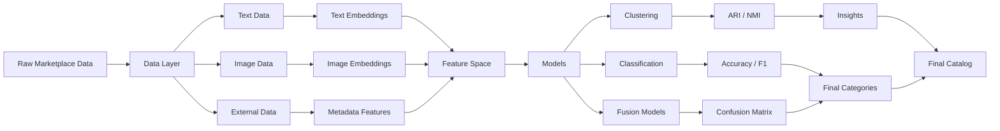

#  Smart Product Categorization System (Multimodal ML Pipeline)

## Project Overview
This project implements a multimodal machine learning system for automated product categorization in an e-commerce marketplace.

The system leverages both **textual descriptions and product images** to classify items into structured categories, combining supervised learning, unsupervised clustering, and feature embedding techniques.

The goal is to replace inconsistent manual labeling with a **scalable, data-driven categorization pipeline**.


## Problem Statement
In marketplace environments, product categorization is often:
- Inconsistent across sellers  
- Manually intensive  
- Poorly scalable as catalog size grows  

This project explores whether product classification can be reliably automated using multimodal machine learning.


## Solution Overview
We design a full ML pipeline combining:

- NLP-based text understanding  
- Computer vision-based image embeddings  
- Unsupervised clustering for structure discovery  
- Supervised classification for production-ready labeling  
- External data enrichment for category expansion  


## Key Learnings
- Multimodal representation learning for real-world e-commerce data  
- Trade-offs between unsupervised discovery and supervised performance  
- Importance of feature alignment across modalities  
- Scaling classification systems beyond single-modality approaches  
- Handling noisy and inconsistent marketplace datasets
- 

## Key Results & Insights
- Text-only models provide strong baseline performance but struggle with ambiguous products  
- Image embeddings significantly improve classification for visually distinctive categories  
- Multimodal fusion improves stability and reduces misclassification in edge cases  
- Clustering reveals meaningful structure in unlabeled product space  
- External data enrichment improves coverage for niche categories  

## Repository Structure

```text
marketplace-product-categorizer/
│
├── notebooks/
│   ├── 01_eda_and_data_exploration.ipynb
│   ├── 02_feature_extraction_and_clustering.ipynb
│   └── 03_product_classification.ipynb
│
├── data/
│   └── raw/
│       └── champagne_products.csv
│
├── scripts/
│   └── champagne_scraper.py
│
├── models/          # Trained models (currently empty)
├── outputs/         # Evaluation results, plots (currently empty)
│
└── README.md
```

## Tech Stack
Python • TensorFlow • Keras • Scikit-learn • PyTorch (embeddings)  
OpenCV • HuggingFace Transformers • NLTK / spaCy  
Pandas • NumPy • Matplotlib • Seaborn  
External APIs (Edamam via RapidAPI)  


## Project Type
Multimodal Machine Learning • Product Categorization • NLP + Computer Vision • Applied Data Science  


## Status
Research-to-prototype system demonstrating feasibility of scalable multimodal product classification for e-commerce platforms.


## System Architecture

### Overview
The system follows a multimodal ML pipeline combining text, image, and external data sources.


### Data Layer
- Product titles and descriptions (text)
- Product images
- External enrichment via Edamam API  


### Feature Engineering

**Text:**
- TF-IDF  
- Word2Vec  
- BERT  
- Universal Sentence Encoder  

**Images:**
- SIFT / ORB  
- ResNet / MobileNet CNN embeddings  


### Modeling

**Unsupervised:**
- KMeans  
- DBSCAN  
- PCA / t-SNE  

**Supervised:**
- CNN classifier  
- TF-IDF + Logistic Regression  
- Multimodal fusion models  


### Evaluation
- ARI / NMI (clustering)  
- Accuracy / F1 (classification)  
- Confusion matrix  


## Pipeline Diagram



## Tech Stack
Python • TensorFlow • Keras • Scikit-learn • PyTorch (embeddings)  
OpenCV • HuggingFace Transformers • NLTK / spaCy  
Pandas • NumPy • Matplotlib • Seaborn  
External APIs (Edamam via RapidAPI)  


## Project Type
Multimodal Machine Learning • Product Categorization • NLP + Computer Vision • Applied Data Science  


## Status
Research-to-prototype system demonstrating feasibility of scalable multimodal product classification for e-commerce platforms.
